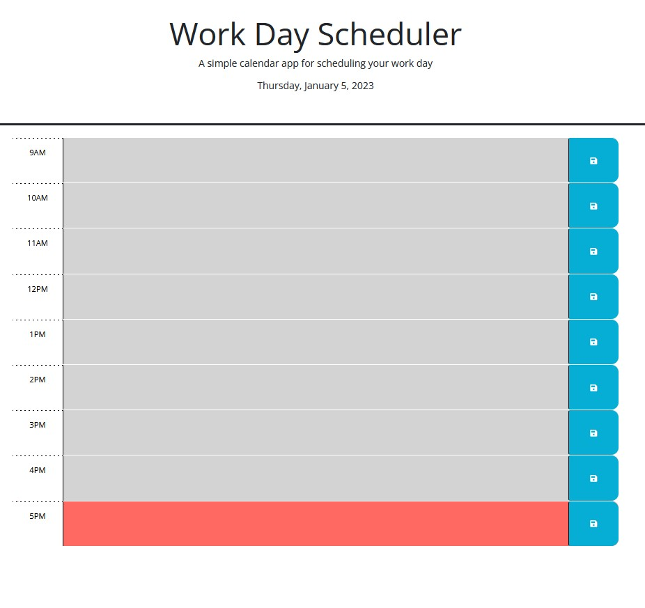

# Schedule Calendar

<!-- PROJECT LOGO -->
 

  <h3 align="center">Schedule Calendar</h3>
 
  

    Challenge 5 on schedule calendar.

  

## Demo
 

  
Demo picture(click to show)

(<a href="#readme-top">back to top</a>)

<!-- ABOUT THE PROJECT -->
## About The Project

### portfolio summary:
<li>Used Jquery to modify a calendar app;
<li>The calendar app can show past/present/future with differnt color;
<li>User can store their todo input and the web will still show it after reloading;

(<a href="#readme-top">back to top</a>)

<!-- LICENSE -->
## License

Distributed under the MIT License. See `LICENSE.txt` for more information.

(<a href="#readme-top">back to top</a>)

<!-- CONTACT -->
## Contact

Lantao Zhang - lantaook@gmail.com

Project Link: [https://pppzlt.github.io/bc-calendar/](https://pppzlt.github.io/bc-calendar/)

(<a href="#readme-top">back to top</a>)

